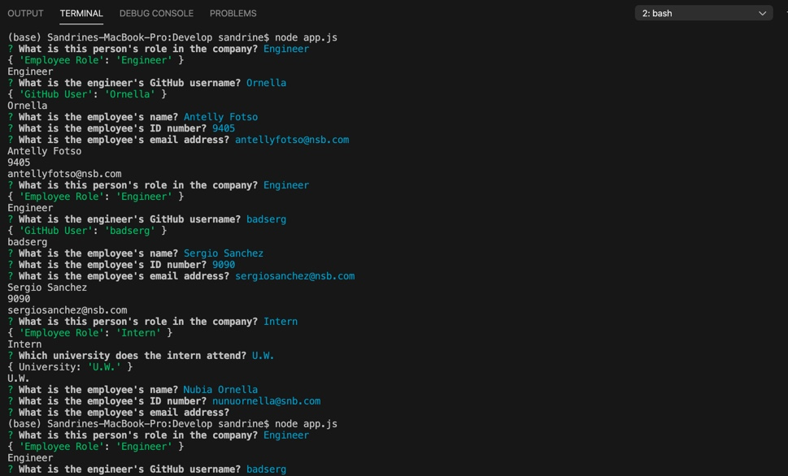
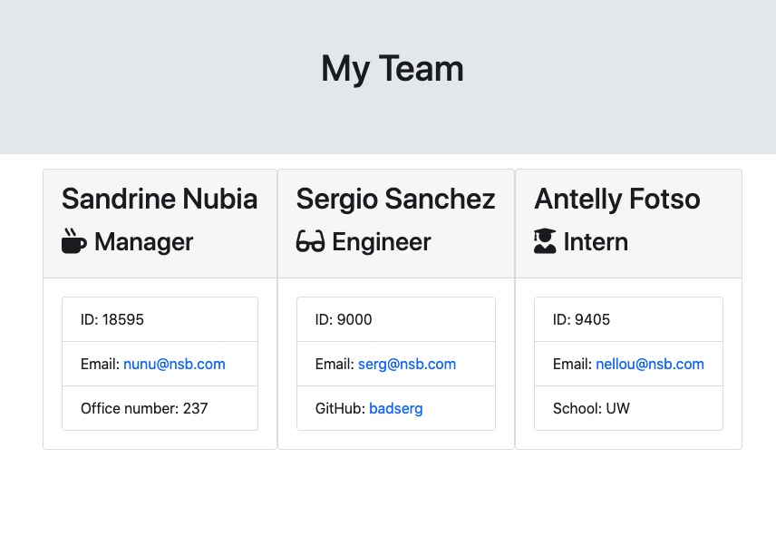

# team

_This is a company employee dashboar_

Like every team, this code has a structure. it allows the user to enter employee information and then translate it into HTML that you can access on a webpage. 

The team presented in this code mainly has three position. either a manager, an intern or an ingereer. The user will be prompt with a general question and their response to that question will prompt the direct questionnaire tailored to the position.

**_Question demo_**

**Technologies used**

# Github

# HTML

# npm

# javascript

**Exemple of a team generated with the code**

[link to the repository](https://github.com/Snubia/team.git)

**_For feedback or contribution_**

[linkedin](https://www.linkedin.com/in/sandrine-nubia-975aa2172/)

# Email: nunubabila@gmail.com

